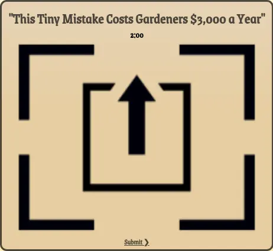
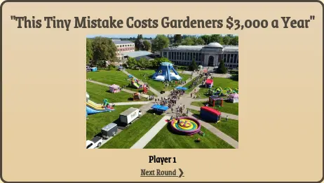

# Newsie

By Will Garrison, Joshua Brown, Sankalp Patil, and Bradley Rule


## Hosting your own:

`git clone` the repo

`npm i` to install dependencies

Change `public/pregame.js` variables to your own domain

Route port 3000 as needed (located in server.js if change needed)

Run `node server.js`

Enjoy!

## How it Works:

### Game State

There are 5 states a game can be in at any time. A game is created once a user
has hit the `Create Game` button and entered a nickname. The game states are as
follows (With a screenshot attached in the dropdown):

<details>
    <summary> Lobby </summary>
    
</details>

<details>
    <summary> Submission </summary>
    
</details>

<details>
    <summary> Voting </summary>
    
</details>

<details>
    <summary>RoundEnd</summary>
    
</details>

<details>
    <summary>GameEnd</summary>
    
</details>


### Hypertext Messages:

---

**GET**
- `/subtitle`

    - Returns a random line from subtitles.txt

    - Status 200

- `*`

    - Handled by Express.js

**POST**
- `?game&name`

    - Joins `game` if exists, as user `name` if available.

    - Status 201 if successful, 400 if not.

- `?game`

    - Checks to see if `game` exists.

    - Status 200 if found, 404 if not found.

- `?name`

    - Creates new game as user `name`.

    - Status 201 including the newly created game code.

### Websocket Messages:

---

**FROM CLIENT**

- Game Creation or Join Game
```js
GameCode + NickName //(ex. "ABC123John Doe")
```
Server: Game manager searches the GameCode's user map for the user NickName, and 
replaces the index with the websocket id. (ex, Users[WebSocket] = Users["John 
Doe"])

- Game Owner Starts Game
```js
"Start Game"
```
- Submit an Image
```js
image: String //Image Base64 Data URL
```
- Submit Votes
```js
votes: [Int] //Array of original indexes rearranged according to vote order
```
- Game Owner Next Round
```js
"Next Round"
```

---

**FROM SERVER**

- Lobby: Update users on join
```js
id: "lobby"
usernames: [String]
gameowner: String
```
- Submission: Send out prompt
```js
id: "round"
headline: String
roundStart: Int //Timestamp
roundEnd: Int //Timestamp
roundNumber: Int
```
- Voting: Send out images to vote on
```js
id: "images"
images: [{
    user: User,
    image: String, //Image Base64 Data URL
    votes: Int
}]
voteStart: Int //Timestamp
voteEnd: Int //Timestamp
roundNumber: Int
```
- Round End: Send out round results
```js
id: "results"
winner: String
winningImage: String //Image Base64 Data URL
currentPoints: Int //Clients total points
pointsEarned: Int //Points client earned this round
roundNumber: Int
```
- Game End: Send out winner
```js
id: "end"
winner: String //Nickname of winner
```